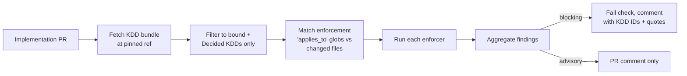

# Using KDDs for Solution Compliance in Code Reviews

Recommendation for how the Key Design Decisions (KDDs) captured in this workspace should be consumed by downstream implementation repositories to verify that built solutions stay aligned with architectural intent.

## Goal

Treat KDDs as the authoritative input for architectural compliance checks at PR-time and on a recurring schedule. Architects write decisions once; implementation repos enforce them automatically and cite them on failure.

## Principles

- KDDs are the **source of truth**. Compliance tooling reads them; it never duplicates their content.
- Enforcement is **opt-in per KDD**, declared in the KDD itself. A decision without an enforcement tag is advisory only.
- Failures **always cite the KDD ID** so a developer can read the decision and the source quote without leaving the PR.
- **Supersedence is respected**: only KDDs with `status: Decided` are enforced. `Superseded` and `Deprecated` are ignored.
- Checks should start as **warnings**, become blocking only once false-positive rate is low.

## What to add to each KDD

Extend the KDD frontmatter with an `enforcement` block. Two-tier model: a narrative `Decision` for humans, a machine-checkable `Constraint` for tooling.

```yaml
---
id: KDD-0007
title: MCP is the default tool protocol
status: Decided
hld_sections: [05-tool-registry, 06-agent-communication]
enforcement:
  - kind: pr-review-agent          # advisory LLM review
    applies_to: ["**/agents/**", "**/tools/**"]
  - kind: conftest                 # blocking policy
    policy: policies/mcp_default.rego
    applies_to: ["**/agents/*.yaml"]
  - kind: ci-lint
    rule: no-raw-tool-rest
    applies_to: ["**/*.py", "**/*.ts"]
---

## Decision
MCP is the default protocol for agent tool exposure.

## Constraint
Every agent definition MUST reference tools via an `mcp_server` entry. Direct REST endpoints in `tools:` are forbidden unless the agent declares `kdd_exception: KDD-0007:<reason>`.
```

Possible `kind` values to standardize:

| Kind | Behavior | Where it runs |
|---|---|---|
| `manual` | Documentation only — reviewers expected to check | n/a |
| `pr-review-agent` | LLM reviewer reads diff + KDD, comments on PR | GitHub Action / ADO pipeline |
| `ci-lint:<rule-id>` | Conventional linter rule (ESLint, ruff, custom) | Pre-merge CI |
| `conftest:<policy>` | OPA Rego policy on YAML/JSON/HCL | Pre-merge CI |
| `archunit:<rule>` | Code-structure assertion (ArchUnit, NetArchTest, ts-arch) | Test suite |
| `iac-policy:<rule>` | Azure Policy / Terraform Sentinel / Checkov | Plan stage |
| `audit-only` | Scanned by weekly drift report, never blocks | Scheduled job |

## What downstream implementation repos need

Each repo that implements part of the platform declares which KDDs it is bound by, in a single file at the repo root:

```yaml
# .architecture/bindings.yaml
hld_repo: https://github.com/<org>/ai-landing-zone-design
hld_ref: v0.4.0           # tag, branch, or commit
required_kdds:
  - KDD-0007              # MCP as default protocol
  - KDD-0011              # private endpoints only
  - KDD-0019              # per-agent Entra identity
  - KDD-0023              # APIM-native MCP for managed exposure
exemptions:
  - kdd: KDD-0011
    scope: scripts/local-dev/**
    reason: local dev sandbox, see ADR-LOCAL-01
    expires: 2026-12-31
```

The HLD repo publishes a versioned bundle (the `decisions/` folder at a tag) that implementation repos pin to. Bumping the pin is a deliberate PR — same model as a dependency upgrade.

## How a compliance run works (end-to-end)



## Compliance matrix (auto-rendered)

The `ailz-doc-sync` skill produces a status table at `docs/compliance-matrix.md` on every HLD repo push. One row per Decided KDD:

| KDD | Title | Enforcement | Bound repos | Last run | Status |
|---|---|---|---|---|---|
| KDD-0007 | MCP default protocol | conftest, ci-lint | 4 | 2026-06-07 | green |
| KDD-0011 | Private endpoints only | iac-policy | 2 | 2026-06-07 | 1 exemption |
| KDD-0019 | Per-agent Entra identity | manual | n/a | — | not enforced |

This is the artifact you bring to a steering committee or a customer audit.

## What the PR Review subagent does

The workspace already has a `PR Review` subagent. Wire it into implementation repos with this prompt template:

1. Read `.architecture/bindings.yaml` from the PR branch.
2. Fetch the KDD bundle at `hld_ref`.
3. For each `required_kdd` whose `applies_to` matches a changed file, append the KDD body to the review context.
4. For each KDD, instruct the agent to:
   - State whether the diff is **compliant**, **non-compliant**, or **out-of-scope**.
   - Quote the KDD's `## Constraint` and the conflicting code lines if non-compliant.
   - Suggest one of: align the code, add an exemption with justification, or open a superseding KDD upstream.
5. Post the consolidated review as a single PR comment grouped by KDD ID.

## Rollout plan

Phased so you never block PRs on noisy checks:

1. **Phase 1 — Advisory only.** Add `enforcement: [{ kind: pr-review-agent }]` to 5–10 high-value KDDs. Subagent comments but never blocks.
2. **Phase 2 — Pin and bind.** First implementation repo adds `.architecture/bindings.yaml` with `required_kdds`. Compliance matrix starts rendering.
3. **Phase 3 — Selective blocking.** Promote the most reliable checks (IaC policies, structural lints) from advisory to blocking. Keep `pr-review-agent` advisory.
4. **Phase 4 — Drift reporting.** Weekly scheduled run produces `docs/compliance-report-YYYY-MM-DD.md`. Compare to last week; track decisions trending toward non-compliance.
5. **Phase 5 — Exemption hygiene.** Quarterly review of `exemptions:` entries; expired exemptions become blocking failures.

## Anti-patterns to avoid

- **Enforcement on prose-only KDDs.** If a KDD doesn't have a `## Constraint` section, don't add a checker — fix the KDD first.
- **Sprawling `applies_to` globs.** A glob of `**/*` catches everything and produces noise. Scope to the file types the constraint actually concerns.
- **Silent exemptions.** Every exemption must name a justification and an expiry date. No expiry ⇒ rejected by the validator.
- **Renumbering KDD IDs.** Never. IDs are immutable; supersedence is the only path to change.
- **Editing KDDs in the implementation repo.** The HLD repo is the only writable source. Implementation repos read, pin, and bind — they do not fork.

## Open questions to settle before Phase 1

- Where do KDD bundles get published? (GitHub release tarball / NPM-style registry / git tag is sufficient for v1.)
- Which CI platform hosts the first compliance pipeline — GitHub Actions, ADO Pipelines, or both?
- Is the `PR Review` subagent invoked in-IDE only, or also as a server-side action on PR open?
- Who owns the `enforcement:` field on a KDD — the deciding architect, or a separate platform/governance role?
